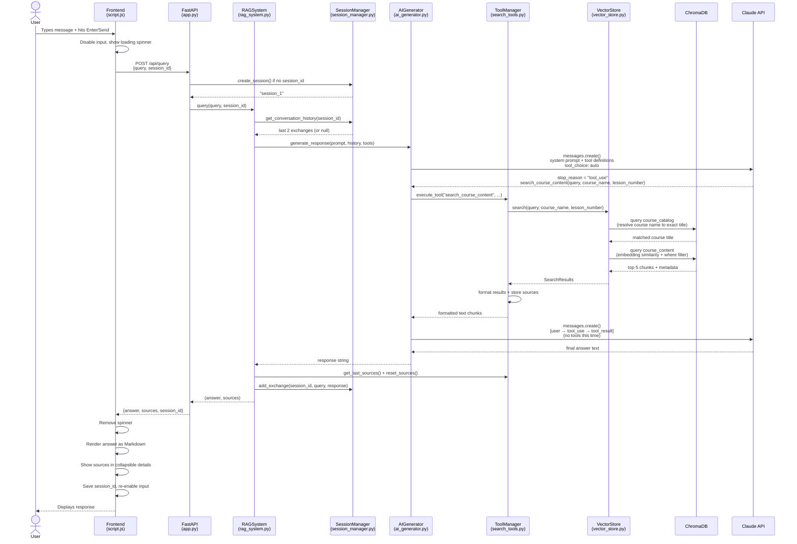

# RAG Chatbot — Request Flow Diagram

```mermaid
sequenceDiagram
    actor User
    participant FE as Frontend<br/>(script.js)
    participant API as FastAPI<br/>(app.py)
    participant RAG as RAGSystem<br/>(rag_system.py)
    participant SM as SessionManager<br/>(session_manager.py)
    participant AI as AIGenerator<br/>(ai_generator.py)
    participant TM as ToolManager<br/>(search_tools.py)
    participant VS as VectorStore<br/>(vector_store.py)
    participant DB as ChromaDB
    participant Claude as Claude API

    User->>FE: Types message + hits Enter/Send
    FE->>FE: Disable input, show loading spinner
    FE->>API: POST /api/query<br/>{query, session_id}

    API->>SM: create_session() if no session_id
    SM-->>API: "session_1"
    API->>RAG: query(query, session_id)

    RAG->>SM: get_conversation_history(session_id)
    SM-->>RAG: last 2 exchanges (or null)

    RAG->>AI: generate_response(prompt, history, tools)

    AI->>Claude: messages.create()<br/>system prompt + tool definitions<br/>tool_choice: auto
    Claude-->>AI: stop_reason = "tool_use"<br/>search_course_content(query, course_name, lesson_number)

    AI->>TM: execute_tool("search_course_content", ...)
    TM->>VS: search(query, course_name, lesson_number)

    VS->>DB: query course_catalog<br/>(resolve course name to exact title)
    DB-->>VS: matched course title

    VS->>DB: query course_content<br/>(embedding similarity + where filter)
    DB-->>VS: top 5 chunks + metadata

    VS-->>TM: SearchResults
    TM->>TM: format results + store sources
    TM-->>AI: formatted text chunks

    AI->>Claude: messages.create()<br/>[user → tool_use → tool_result]<br/>(no tools this time)
    Claude-->>AI: final answer text

    AI-->>RAG: response string
    RAG->>TM: get_last_sources() + reset_sources()
    RAG->>SM: add_exchange(session_id, query, response)
    RAG-->>API: (answer, sources)

    API-->>FE: {answer, sources, session_id}

    FE->>FE: Remove spinner
    FE->>FE: Render answer as Markdown
    FE->>FE: Show sources in collapsible details
    FE->>FE: Save session_id, re-enable input
    FE-->>User: Displays response
```
