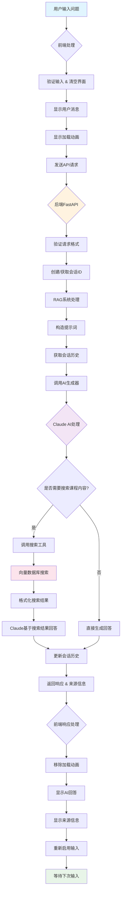
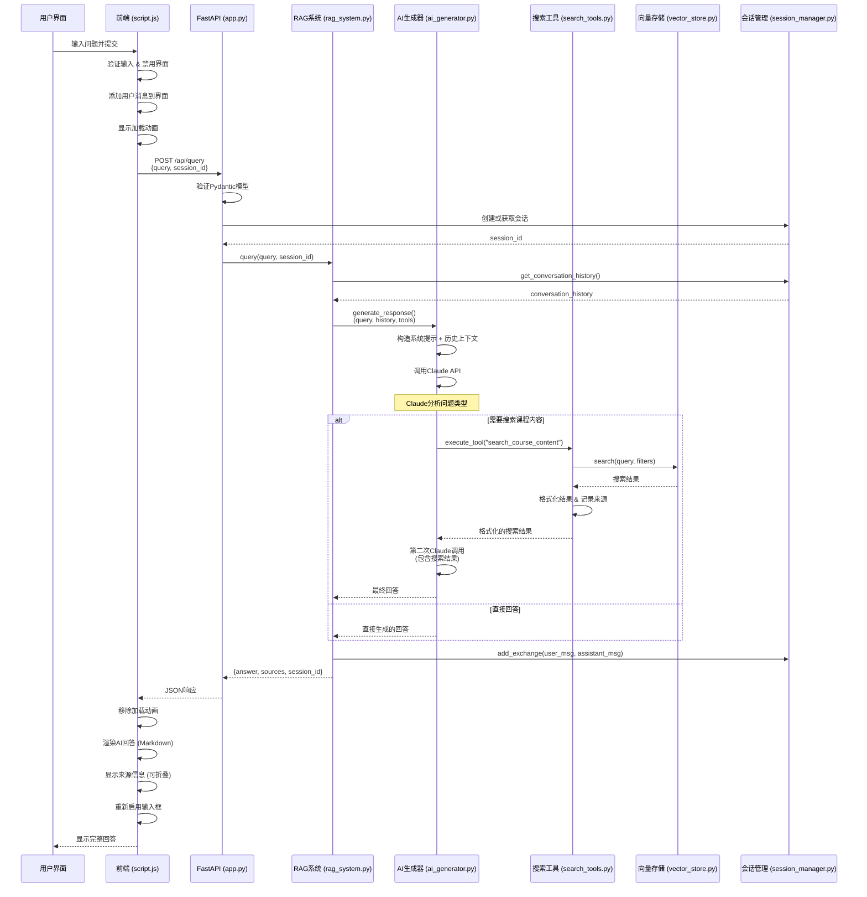
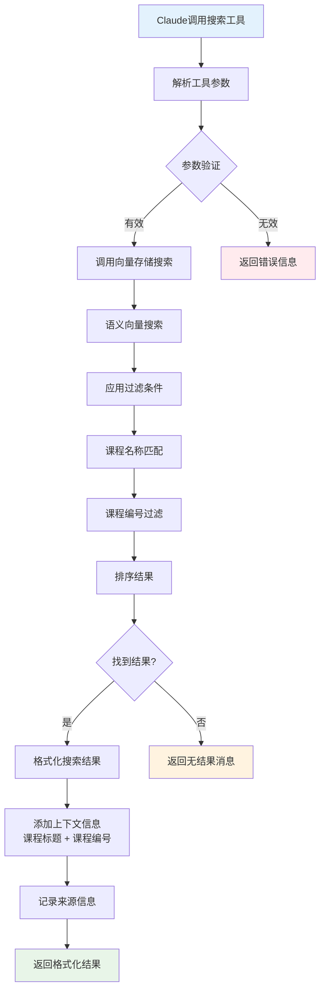
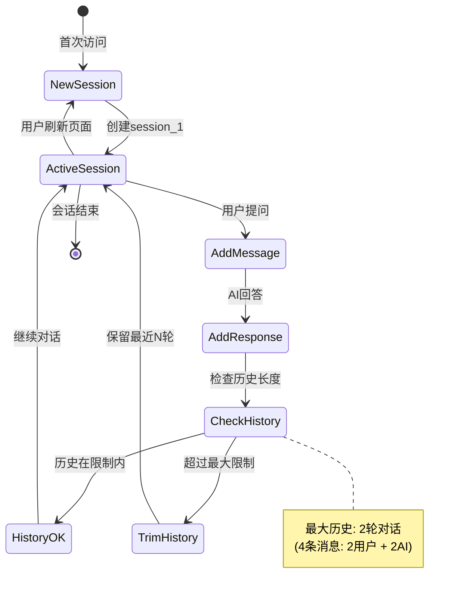
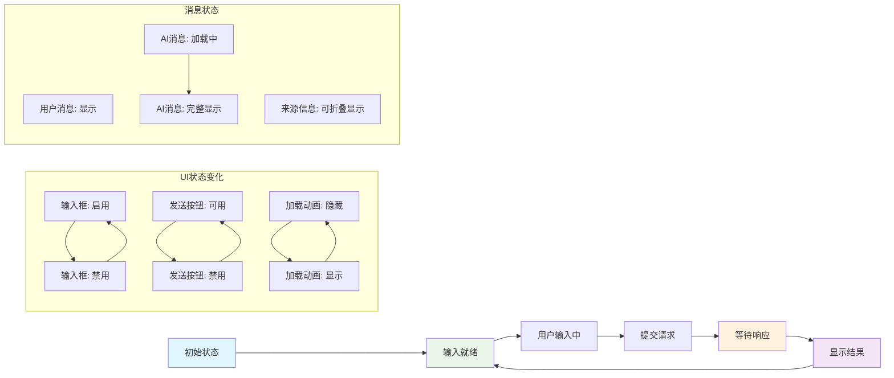
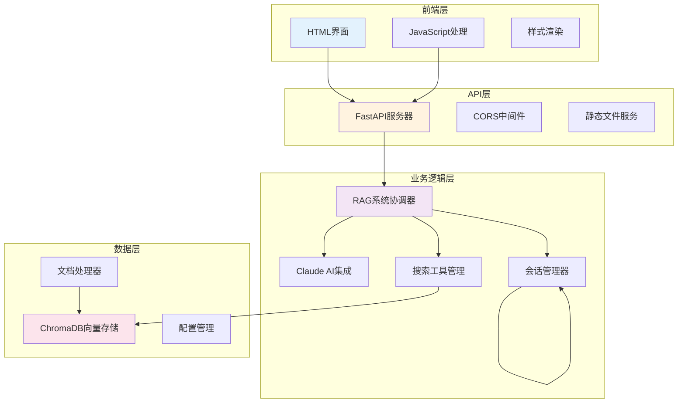

# 用户输入处理流程图

## 整体架构流程图

```mermaid
graph TD
    A[用户输入问题] --> B{前端处理}
    B --> C[验证输入 & 清空界面]
    C --> D[显示用户消息]
    D --> E[显示加载动画]
    E --> F[发送API请求]

    F --> G{后端FastAPI}
    G --> H[验证请求格式]
    H --> I[创建/获取会话ID]
    I --> J[RAG系统处理]

    J --> K[构造提示词]
    K --> L[获取会话历史]
    L --> M[调用AI生成器]

    M --> N{Claude AI处理}
    N --> O{是否需要搜索课程内容?}
    O -->|是| P[调用搜索工具]
    O -->|否| Q[直接生成回答]

    P --> R[向量数据库搜索]
    R --> S[格式化搜索结果]
    S --> T[Claude基于搜索结果回答]
    T --> U[更新会话历史]

    Q --> U
    U --> V[返回响应 & 来源信息]

    V --> W{前端响应处理}
    W --> X[移除加载动画]
    X --> Y[显示AI回答]
    Y --> Z[显示来源信息]
    Z --> AA[重新启用输入]
    AA --> BB[等待下次输入]

    style A fill:#e1f5fe
    style BB fill:#e8f5e8
    style G fill:#fff3e0
    style N fill:#f3e5f5
    style R fill:#fce4ec
```

## 详细组件交互图

```mermaid
sequenceDiagram
    participant U as 用户界面
    participant F as 前端 (script.js)
    participant API as FastAPI (app.py)
    participant RAG as RAG系统 (rag_system.py)
    participant AI as AI生成器 (ai_generator.py)
    participant ST as 搜索工具 (search_tools.py)
    participant VS as 向量存储 (vector_store.py)
    participant SM as 会话管理 (session_manager.py)

    U->>F: 输入问题并提交
    F->>F: 验证输入 & 禁用界面
    F->>F: 添加用户消息到界面
    F->>F: 显示加载动画

    F->>API: POST /api/query<br/>{query, session_id}
    API->>API: 验证Pydantic模型
    API->>SM: 创建或获取会话
    SM-->>API: session_id

    API->>RAG: query(query, session_id)
    RAG->>SM: get_conversation_history()
    SM-->>RAG: conversation_history

    RAG->>AI: generate_response()<br/>(query, history, tools)
    AI->>AI: 构造系统提示 + 历史上下文

    AI->>AI: 调用Claude API
    Note over AI: Claude分析问题类型

    alt 需要搜索课程内容
        AI->>ST: execute_tool("search_course_content")
        ST->>VS: search(query, filters)
        VS-->>ST: 搜索结果
        ST->>ST: 格式化结果 & 记录来源
        ST-->>AI: 格式化的搜索结果

        AI->>AI: 第二次Claude调用<br/>(包含搜索结果)
        AI-->>RAG: 最终回答
    else 直接回答
        AI-->>RAG: 直接生成的回答
    end

    RAG->>SM: add_exchange(user_msg, assistant_msg)
    RAG-->>API: {answer, sources, session_id}
    API-->>F: JSON响应

    F->>F: 移除加载动画
    F->>F: 渲染AI回答 (Markdown)
    F->>F: 显示来源信息 (可折叠)
    F->>F: 重新启用输入框

    F-->>U: 显示完整回答
```

## 核心组件内部流程图

### 1. 文档搜索工具流程

```mermaid
graph TD
    A[Claude调用搜索工具] --> B[解析工具参数]
    B --> C{参数验证}
    C -->|有效| D[调用向量存储搜索]
    C -->|无效| E[返回错误信息]

    D --> F[语义向量搜索]
    F --> G[应用过滤条件]
    G --> H[课程名称匹配]
    H --> I[课程编号过滤]
    I --> J[排序结果]

    J --> K{找到结果?}
    K -->|是| L[格式化搜索结果]
    K -->|否| M[返回无结果消息]

    L --> N[添加上下文信息<br/>课程标题 + 课程编号]
    N --> O[记录来源信息]
    O --> P[返回格式化结果]

    style A fill:#e3f2fd
    style P fill:#e8f5e8
    style E fill:#ffebee
    style M fill:#fff3e0
```

### 2. 会话管理流程

```mermaid
stateDiagram-v2
    [*] --> NewSession: 首次访问
    NewSession --> ActiveSession: 创建session_1

    ActiveSession --> AddMessage: 用户提问
    AddMessage --> AddResponse: AI回答
    AddResponse --> CheckHistory: 检查历史长度

    CheckHistory --> HistoryOK: 历史在限制内
    CheckHistory --> TrimHistory: 超过最大限制

    HistoryOK --> ActiveSession: 继续对话
    TrimHistory --> ActiveSession: 保留最近N轮

    ActiveSession --> NewSession: 用户刷新页面
    ActiveSession --> [*]: 会话结束

    note right of CheckHistory
        最大历史: 2轮对话
        (4条消息: 2用户 + 2AI)
    end note
```

### 3. 前端状态管理流程

```mermaid
graph LR
    A[初始状态] --> B[输入就绪]
    B --> C[用户输入中]
    C --> D[提交请求]
    D --> E[等待响应]
    E --> F[显示结果]
    F --> B

    subgraph "UI状态变化"
        G[输入框: 启用] --> H[输入框: 禁用]
        H --> G
        I[发送按钮: 可用] --> J[发送按钮: 禁用]
        J --> I
        K[加载动画: 隐藏] --> L[加载动画: 显示]
        L --> K
    end

    subgraph "消息状态"
        M[用户消息: 显示]
        N[AI消息: 加载中] --> O[AI消息: 完整显示]
        P[来源信息: 可折叠显示]
    end

    style A fill:#e1f5fe
    style B fill:#e8f5e8
    style E fill:#fff3e0
    style F fill:#f3e5f5
```

## 技术栈组件图

```mermaid
graph TB
    subgraph "前端层"
        UI[HTML界面]
        JS[JavaScript处理]
        CSS[样式渲染]
    end

    subgraph "API层"
        FastAPI[FastAPI服务器]
        CORS[CORS中间件]
        Static[静态文件服务]
    end

    subgraph "业务逻辑层"
        RAG[RAG系统协调器]
        AI[Claude AI集成]
        Tools[搜索工具管理]
        Session[会话管理器]
    end

    subgraph "数据层"
        Chroma[ChromaDB向量存储]
        Docs[文档处理器]
        Config[配置管理]
    end

    UI --> FastAPI
    JS --> FastAPI
    FastAPI --> RAG
    RAG --> AI
    RAG --> Tools
    RAG --> Session
    Tools --> Chroma
    Session --> Session
    Docs --> Chroma

    style UI fill:#e3f2fd
    style FastAPI fill:#fff3e0
    style RAG fill:#f3e5f5
    style Chroma fill:#fce4ec
```

这些流程图详细展示了从用户输入到获得回答的完整处理过程，包括各个组件之间的交互、数据流向和状态变化。每个图都从不同角度展示了系统的工作机制。